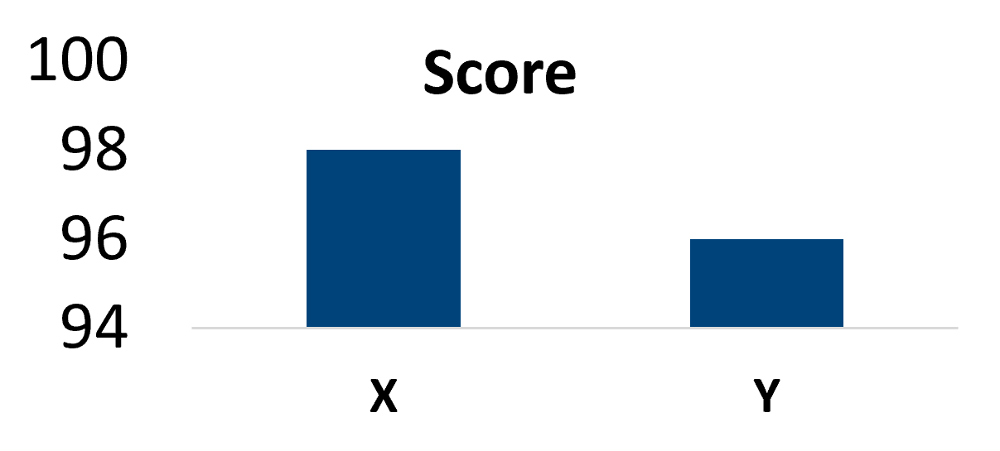

# Statistics Refresher

Remember your favorite class in high school and/or college? Well, luckily, this is not that class. In fact, I am really going to breeze through this section because neither myself or you guys *need* to be a statistician. We are engineers and inspectors who often assume pi equals 3. The concepts of the theory are important though, so bear with me. 

## Statistics introduction

### Why use statistics?

Statistics is the discipline of **reasoning under uncertainty**. Without it, data is just numbers.

- **Summarize** — describe the sample through descriptive statistics.
- **Identify** — trends, patterns, and relationships in available data.
- **Infer** — make inferences about a population from the sample.
- **Predict** — model and predict future behavior from available data.

### Why understand statistics?

Statistics are powerful and easily misused. Common pitfalls:

- **Susceptible to manipulation** — cherry-picked samples, p-hacking, pre-determined conclusions.
- **Misleading visualizations** — visuals can imply trends that aren't there.
- **Correlation ≠ causation** — variables may appear correlated without any causal relationship.
- **Understand the underlying model** — all models are wrong, but some are useful, and some are more useful than others.

## Responsible statistics

The difference between deceptive and responsible reporting:

| ✗ Deceptive | ✓ Responsible |
|--|--|
| "X scored significantly better than Y"<br><br> | "Median savings was \$340 (n = 430, 95% CI [\$210, \$470]); 28% of users saw no benefit or net loss." |

Key principles:

- **Ethical and transparent** — share data, code, methods; understand and report biases or incomplete data.
- **Quantify uncertainty** — understand confidence and error in estimates.
- **Measured vs. inferred** — report what is observed vs. what is estimated or assumed.
- **Document assumptions** — distributional assumptions, data cleaning, software versions, etc...

## The Rumsfeld matrix

> *There are known knowns; there are things we know we know. We also know there are known unknowns; that is to say, we know there are some things we do not know. But there are also unknown unknowns—the ones we don't know we don't know*

Remember this guy? Well the concept has been around for longer than him, but I remember watching the news when he said this, and thinking to myself, *"What?"*. When you really think about it though, it makes sense, and it really helps when predictions do not match reality. You can have a great model completely fall apart because of some random unknown that would have been impossible to guess.


```{figure} ../images/rumsfeld.png
:name: rumsfeld
:alt: Rumsfeld Matrix
:width: 600px
:align: center

Understand what you know and what you are aware of and know the difference between knowledge and awareness.
```


```{important}
**Unknown unknowns are unknowable by definition.** No statistical method can detect or quantify a risk never observed or conceived. The only mitigation is to inspect everything in every way — which is impractical and impossible.

The goal of statistical analysis is to **make inferences about some of the unknowns** using prior knowledge and the existing data.
```

If you want to know how many whales are in the ocean (population), and you decide to figure this out by sampling with a bucket, you might shockingly discover that there are no whales in the ocean (if you trust your sampling). You have absence of evidence. Obviously, this is an extreme example, and you know that whales exist in the ocean. You have an unknown known; something you have not observed, but know is possible. This is also a demonstration of poor measurement or sampling technique as it would be impossible to fit even a baby whale in a bucket (how big is the biggest bucket?). Real sampling for population of whales is actually challenging with a combination of aerial sightings, acoustic surveys, and physical counting and marking. The absence of evidence is not evidence of absence.

```{figure} ../images/whale.png
:name: whale
:alt: whale
:width: 200px
:align: center

Poor whale just wants to be sampled
```


## Probability and Statistics Primer

```{figure} ../images/flow-stats.png
:name: flow-stats
:alt: flow-stats
:width: 700px
:align: center

The general flow of statistics.
```

## Samples and populations

- **Population** — every member of the group of interest. Usually impractical to measure in full.
- **Sample** — a subset chosen to represent the population; what is actually measured.
- **Variable** — the characteristic recorded for each sample (thickness, height, failure time).

```{figure} ../images/population2.png
:name: population
:alt: Population, Variable, and Sample
:width: 500px
:align: center

Variables within a population and a sample
```

### Notation: parameters vs. statistics

| | Population (parameter) | Sample (statistic) |
|--|--|--|
| Size | $N$ | $n$ |
| Mean | $\mu$ | $\bar{x}$ |
| Variance | $\sigma^2$ | $s^2$ |
| Std deviation | $\sigma$ | $s$ |

## Sampling methods and bias

### Common sampling methods

- **Simple random** — every unit equally likely.
- **Stratified** — sample within strata (lower variance).
- **Cluster** — sample whole groups (cheaper).
- **Systematic** — every $k$-th element.

### Sampling bias

A sample is meant to represent the population, but truly representative samples may not always be possible. **Bias is not always bad**, but be aware of it.

- **Selection bias** — sampling only where you expect to find something. *For CMLs, this is generally desired.*
- **Non-response bias** — those who don't reply differ from those who do.
- **Survivorship bias** — only the survivors are visible in the data.

## Law of Large Numbers

The sample mean → population mean as $n \to \infty$.

$$\bar{X}_n \xrightarrow{p} \mu \;\; \text{as} \;\; n \to \infty$$

More data = more reliable estimates (in expectation).

```{figure} ../images/lln.png
:name: lln
:alt: Law of large numbers
:width: 600px
:align: center

Law of large numbers
```

## Central Limit Theorem

The **sample mean** is approximately Normal — *regardless of the population distribution* — provided the population has finite variance:

$$\bar{X}_n \;\dot\sim\; \mathcal{N}\!\left(\mu, \frac{\sigma^2}{n}\right)$$

This is the foundation for classical inference: z-tests, t-tests, confidence intervals. It is what allows the Normal Distribution to be used in statistics even when the population is not normally distributed. 

```{figure} ../images/clt.png
:name: clt
:alt: CLT — sampling distribution of the mean
:width: 700px
:align: center

Central limit theorem
```

Read left → right with increasing $n$: at $n=2$ the sampling distribution of the mean is still very skewed and a Normal overlay fits poorly. By $n=50$ it is tight, centered on $\mu$, and well-approximated by the Normal — even though the underlying distribution (Exponential) is heavily skewed.

```{raw} html
<iframe src="../_static/clt_exponential_demo.html"
        width="100%" height="850"
        style="border:1px solid #ddd; border-radius:8px;">
</iframe>
```

```{important}
The CLT is *not* a statement about the data — it's a statement about the **sample mean**. Your raw data can be wildly non-normal; the means of repeated samples will still tend toward normality.
```

## Descriptive statistics

### Measures of central tendency

- **Mean** — sensitive to outliers. Best for symmetric, unimodal distributions.
- **Median** — robust to outliers. Always at the 50th percentile.
- **Mode** — value(s) with highest frequency. The only summary for categorical data.

```{figure} ../images/central_tendency.png
:name: central-tendency
:alt: Central tendency on a skewed sample
:width: 500px
:align: center

Measures of central tendency
```

On a skewed sample, the three measures separate. The mean is pulled by the long right tail, while the median sits at the 50th percentile regardless. The mode is the most common value.

### Measures of variability

- **Variance and standard deviation** — average distance from the mean. Most common spread statistic. Sensitive to outliers.
- **Range** — entire spread including outliers. Very sensitive to outliers.
- **Interquartile range (IQR)** — Q3 minus Q1. Robust to outliers.

For a sample with $n$ observations:

$$s^2 = \frac{1}{n-1}\sum_{i=1}^{n}(x_i - \bar{x})^2 \qquad s = \sqrt{s^2}$$

The denominator $n-1$ (rather than $n$) is **Bessel's correction**, which produces an unbiased estimator of the population variance.

```{figure} ../images/variability.png
:name: variability
:alt: Variability comparison
:width: 600px
:align: center

Two different distributions with the same mean, but different variability
```

Two distributions with the same mean but different spread. The wider $\sigma=12$ distribution has the same center but covers much more ground — the boxplot underneath shows the contrast in IQR clearly.

### Coefficient of variation (CV)

Standard deviation in absolute units depends on the scale of the variable. To compare spread across variables on different scales, normalize:

$$\text{CV} = \frac{s}{\bar{x}}$$

CV is unitless, often reported as a percentage. It's particularly useful in inspection work where pipe thickness varies by component size — a $\pm$ 0.030" variation is a different fraction of nominal for a 4" SCH40 pipe than for a 24" SCH80.

```{note}
**Rule of thumb in CML work:** A CV < 10% within a TML is generally acceptable. Higher CV suggests localized corrosion, measurement issues, or improper grouping.
```

### Shape: skewness

Skewness measures **asymmetry**:

$$g_1 = \frac{1}{n}\sum_{i=1}^{n}\left(\frac{x_i - \bar{x}}{s}\right)^3$$

- **Left-skewed** (negative skew) — long left tail; **mean < median**. Example: age at death.
- **Symmetric** — skew ≈ 0; mean ≈ median. Example: heights.
- **Right-skewed** (positive skew) — long right tail; **mean > median**. Example: incomes, corrosion rates.

```{figure} ../images/skew.png
:name: skew
:alt: Skew of distributions
:width: 650px
:align: center

Types of skew
```

Note where the mean (dashed line) sits relative to the median (solid line) in each case. The position of mean relative to median is a quick visual check for skew direction.

### Shape: kurtosis

Kurtosis measures **tail weight** — how often extreme values appear:

$$g_2 = \frac{1}{n}\sum_{i=1}^{n}\left(\frac{x_i - \bar{x}}{s}\right)^4 - 3$$

- **Leptokurtic** — heavy tails, sharp peak. Example: financial returns, t-distribution with low df.
- **Mesokurtic** — normal-like tails. Example: many natural phenomena.
- **Platykurtic** — light tails, flat peak. Example: uniform distribution.

```{figure} ../images/kurtosis.png
:name: kurtosis
:alt: Kurtosis of distributions
:width: 650px
:align: center

Types of kurtosis
```

Heavy-tailed distributions produce extreme outliers far more often than a Normal would predict. This matters in reliability work — a thickness reading 5σ below the fitted mean is almost impossible under a Normal model, but could be a one-in-a-thousand event under a t-distribution.

## Expectation, variance, and moments

For a random variable $X$, the **expectation** (mean) is

$$E[X] = \sum_x x \, p(x) \quad \text{(discrete)} \qquad E[X] = \int x \, f(x)\, dx \quad \text{(continuous)}$$

The **variance** is

$$\text{Var}(X) = E[(X - E[X])^2] = E[X^2] - E[X]^2$$

These are the **first two moments** of the distribution. Higher moments give skew (3rd) and kurtosis (4th).

### Linearity of expectation

For any constants $a, b$ and random variables $X, Y$:

$$E[aX + bY] = a\,E[X] + b\,E[Y]$$

Linearity holds **whether or not $X$ and $Y$ are independent** — this is what makes expectations easy to work with. Variance, in contrast, is not linear:

$$\text{Var}(aX + bY) = a^2\,\text{Var}(X) + b^2\,\text{Var}(Y) + 2ab\,\text{Cov}(X, Y)$$

If $X$ and $Y$ are independent, $\text{Cov}(X, Y) = 0$ and the cross-term vanishes.

## Independence and covariance

Two random variables $X$ and $Y$ are **independent** if knowing one tells you nothing about the other:

$$p(X, Y) = p(X) \cdot p(Y)$$

**Covariance** measures the direction of joint variation:

$$\text{Cov}(X, Y) = E[(X - E[X])(Y - E[Y])]$$

**Correlation** is the unitless version, scaled to $[-1, 1]$:

$$\rho_{X,Y} = \frac{\text{Cov}(X, Y)}{\sigma_X \sigma_Y}$$

```{warning}
**Independence implies zero correlation, but zero correlation does NOT imply independence.** Correlation only captures linear relationships. Two variables can be perfectly dependent but uncorrelated (e.g., $Y = X^2$ when $X$ is symmetric around zero).
```

Independence matters for inspection data because most statistical methods assume observations are independent. CML readings on the same circuit are often *not* independent — they share environment, material, and operating history. This is one of the motivations for the hierarchical Bayesian models in chapter 4.

## Plotting data

### Histogram

Bins data into ranges, counts per bin. Reveals at a glance:

- Shape and modality
- Center and spread
- Outliers
- Skew

A histogram is always a great place to begin exploratory data analysis.

```python
import numpy as np
import matplotlib.pyplot as plt
import seaborn as sns

np.random.seed(42)
data = np.random.normal(loc=50, scale=10, size=500)

sns.histplot(data, kde=True, color='blue', alpha=0.6)
plt.show()
```

```{warning}
**Bin size matters.** Too few bins hides structure; too many adds noise. Try a few before drawing conclusions.
```

```{figure} ../images/bin_count.png
:name: histogram-bins
:alt: Effect of bin count
:width: 800px
:align: center

Goldilocks histograms
```

### Empirical CDF (ECDF)

Proportion of data ≤ x.

- Every data point is a step.
- No binning decisions.
- Less intuitive shape representation, but ideal for comparing distributions.

```python
import seaborn as sns
sns.ecdfplot(data, color='steelblue', linewidth=2.5)
```

```{figure} ../images/ecdf.png
:name: ecdf
:alt: Empirical CDF
:width: 600px
:align: center

Empirical CDF
```

The horizontal lines at 25%, 50%, and 75% make it easy to read off the quartiles directly from the plot. To compare two distributions, overlay their ECDFs:

```{image} ../images/ecdf_compare.png
:alt: ECDF comparison
:width: 600px
:align: center
```

Differences in shape, shift, and spread all show up in one view.

### Probability plots

Check normality (or fit to other distributions) by visually checking linearity.

```python
import pingouin as pg
pg.qqplot(data, dist='norm', confidence=0.95)
```

```{figure} ../images/qq_norm.png
:name: qq-norm
:alt: Normal probability plot
:width: 500px
:align: center

PP plot
```

A good fit produces a straight line along the diagonal. Systematic curvature suggests the candidate distribution doesn't match — try a different one, or look for sub-populations that should be clustered separately.

## Probability

### Core concept

Probability describes the likelihood of an event occurring. In inspection, it represents the chance that a given thickness value or corrosion rate occurs within the circuit population.

### Frequentist definition

$P(A)$ is the limit of the fraction of $m$ outcomes in $A$ and $n$ total outcomes as $n \to \infty$. *Long-run frequency interpretation.*

$$P(A) = \lim_{n \to \infty} \frac{m}{n}$$

### Kolmogorov's three axioms

Probabilities are valid measures of likelihood if they satisfy:

1. $P(A) \ge 0$ for any event $A$.
2. $P(\Omega) = 1$ — something must happen.
3. For disjoint events: $P(A \cup B) = P(A) + P(B)$.

### Sets

A **set** is a collection of elements, such as numbers, points in space, shapes, variables, or other sets. A set does not contain duplicate elements.

The set with no elements is a special set called the **empty set**, denoted $\emptyset$.

The **set union** $A \cup B$ of two sets $A$ and $B$ is the set of all elements that are in either set $A$ or in set $B$. Formally: $A \cup B = \{a \mid a \in A \lor a \in B\}$.

The **set intersection** $A \cap B$ of two sets $A$ and $B$ is the set of all elements that are in both set $A$ and set $B$. Formally: $A \cap B = \{a \mid a \in A \land a \in B\}$.

The **set subtraction** $A - B$ of two sets $A$ and $B$ is the set of all elements that are in set $A$ but not in set $B$. Formally: $A - B = \{a \mid a \in A \land a \notin B\}$.

Like any set, $A \cup B$, $A \cap B$, and $A - B$ do not contain duplicate elements. If an element $a$ is in $A$ and in $B$, it is represented just once in $A \cup B$, in $A \cap B$, and in $A - B$.

```{figure} ../images/sets.png
:name: sets
:alt: sets
:width: 700px
:align: center

Different set operations
```

### Probability rules

- **Complement:** $P(A^c) = 1 - P(A)$
- **Addition:** $P(A \cup B) = P(A) + P(B) - P(A \cap B)$
- **Multiplication (independent):** $P(A \cap B) = P(A) \cdot P(B)$
- **Conditional:** $P(A \mid B) = P(A \cap B) / P(B)$
- **Law of total probability:** $P(A) = \sum_i P(A \mid B_i) P(B_i)$

### Bayes' theorem

The single most important formula in modern statistics:

$$P(A \mid B) = \frac{P(B \mid A)\,P(A)}{P(B)}$$

It tells you how to *update* your belief about $A$ after observing $B$. The prior $P(A)$ becomes the posterior $P(A \mid B)$, mediated by the likelihood $P(B \mid A)$.

#### A worked example: medical testing

Suppose a disease affects 1 in 1,000 people. A diagnostic test has:

- 99% sensitivity: $P(\text{positive} \mid \text{disease}) = 0.99$
- 95% specificity: $P(\text{negative} \mid \text{no disease}) = 0.95$, so $P(\text{positive} \mid \text{no disease}) = 0.05$

A patient tests positive. What's the probability they have the disease?

Apply Bayes' theorem:

$$P(\text{disease} \mid +) = \frac{P(+ \mid \text{disease}) \, P(\text{disease})}{P(+)}$$

The numerator is straightforward: $0.99 \times 0.001 = 0.00099$.

The denominator uses the law of total probability:

$$P(+) = P(+ \mid \text{D}) P(\text{D}) + P(+ \mid \text{no D}) P(\text{no D}) = 0.99 \times 0.001 + 0.05 \times 0.999 = 0.05094$$

So:

$$P(\text{disease} \mid +) = \frac{0.00099}{0.05094} \approx 0.019 \approx 2\%$$

**Despite a positive result from a 99%-sensitive test, the probability the patient is actually sick is only about 2%.** The low base rate (1 in 1,000) dominates the calculation. This is the **base rate fallacy**, and it's the most common error people make in interpreting test results.

The same logic applies to inspection: a single low thickness reading at a randomly chosen CML doesn't tell you much if your prior belief is that most of the circuit is fine. You need to update on the base rate of corroding CMLs, not just the reading itself.

## Probability distributions

A **probability distribution** describes the likelihood of different outcomes in a random experiment.

- **Random variable** — a variable whose value is determined by chance.
- **PMF** — probability mass function (discrete distributions): $P(X = x)$.
- **PDF** — probability density function (continuous distributions): density at each value.
- **CDF** — cumulative distribution function: $P(X \le x)$.

### Distribution roadmap

| Variable type | Support | Distributions |
|--|--|--|
| Discrete | Finite | Uniform, Binomial, Bernoulli |
| Discrete | Infinite | Poisson |
| Continuous | Bounded | Uniform, Beta |
| Continuous | Positive | Half-Normal, Lognormal, Exponential, Gamma, Weibull |
| Continuous | Infinite | Normal, Logistic |

The rest of this chapter walks through each in turn.

```{figure} ../images/distribution-summary.png
:name: distribution-summary
:alt: Distributions
:width: 700px
:align: center

Summary of a selection of probability distributions
```

## Discrete distributions

### Discrete Uniform

All discrete outcomes equally likely. Used as an uninformative prior in Bayesian work.

| | |
|--|--|
| **Parameters** | $a$ (lower), $b$ (upper), both integers |
| **Support** | $x \in \{a, a+1, \ldots, b\}$ |
| **PMF** | $P(X = x) = \dfrac{1}{b - a + 1}$ |
| **CDF** | $F(x) = \dfrac{\lfloor x \rfloor - a + 1}{b - a + 1}$ |
| **Mean** | $\dfrac{a + b}{2}$ |
| **Variance** | $\dfrac{(b - a + 1)^2 - 1}{12}$ |

*Example: rolling a fair die — $a = 1$, $b = 6$.*

```{figure} ../images/dist_uniform_discrete.png
:name: uniform-discrete
:alt: Discrete uniform distribution
:width: 500px
:align: center

Discrete Uniform Distribution
```

### Bernoulli

The outcomes of a **single trial** with two outcomes (success/failure). The atom from which the Binomial is built.

| | |
|--|--|
| **Parameters** | $p \in [0, 1]$ |
| **Support** | $x \in \{0, 1\}$ |
| **PMF** | $P(X = x) = p^x (1-p)^{1-x}$ |
| **CDF** | $F(x) = \begin{cases} 0 & x < 0 \\ 1-p & 0 \le x < 1 \\ 1 & x \ge 1 \end{cases}$ |
| **Mean** | $p$ |
| **Variance** | $p(1-p)$ |

*Example: a single inspection POD trial — pit detected or not detected.*

```{figure} ../images/dist_bernoulli.png
:name: dist-bernoulli
:alt: Bernoulli distribution
:width: 500px
:align: center

Bernoulli Distribution
```

### Binomial

Number of successes in $n$ independent Bernoulli trials.

| | |
|--|--|
| **Parameters** | $n$ (trials), $p \in [0, 1]$ (success probability) |
| **Support** | $x \in \{0, 1, \ldots, n\}$ |
| **PMF** | $P(X = x) = \binom{n}{x} p^x (1-p)^{n-x}$ |
| **Mean** | $np$ |
| **Variance** | $np(1-p)$ |

*Example: defective fittings in a batch of 100, where each has a 2% defect rate.*

```{figure} ../images/dist_binomial.png
:name: dist-binominal
:alt: Binomial distribution
:width: 600px
:align: center

Binomial Distribution
```

### Poisson

Number of events in a fixed interval, given a constant average rate. Limit of Binomial as $n \to \infty$, $p \to 0$, with $np = \lambda$ fixed.

| | |
|--|--|
| **Parameters** | $\lambda > 0$ (mean rate) |
| **Support** | $x \in \{0, 1, 2, \ldots\}$ |
| **PMF** | $P(X = x) = \dfrac{\lambda^x e^{-\lambda}}{x!}$ |
| **Mean** | $\lambda$ |
| **Variance** | $\lambda$ |

The fact that mean equals variance is the distinctive Poisson property — useful for sanity-checking whether count data is actually Poisson.

*Example: equipment failures per year, leaks per mile of pipe, defects per unit area.*

```{figure} ../images/dist_poisson.png
:name: dist-poisson
:alt: Poisson distribution
:width: 600px
:align: center

Poisson Distribution
```

## Continuous distributions

### Continuous Uniform

All values in $[a, b]$ equally likely.

| | |
|--|--|
| **Parameters** | $a < b$ (real) |
| **Support** | $x \in [a, b]$ |
| **PDF** | $f(x) = \dfrac{1}{b - a}$ |
| **CDF** | $F(x) = \dfrac{x - a}{b - a}$ |
| **Mean** | $\dfrac{a + b}{2}$ |
| **Variance** | $\dfrac{(b - a)^2}{12}$ |

*Example: noise injected uniformly in a range; "no prior information" Bayesian prior.*

```{figure} ../images/dist_uniform_continuous.png
:name: uniform-continuous
:alt: Continuous uniform distribution
:width: 600px
:align: center

Continuous Uniform Distribution
```

### Normal

The bell curve — appears wherever many small effects add up (Central Limit Theorem).

| | |
|--|--|
| **Parameters** | $\mu$ (mean), $\sigma > 0$ (std) |
| **Support** | $x \in (-\infty, \infty)$ |
| **PDF** | $f(x) = \dfrac{1}{\sigma\sqrt{2\pi}}\exp\!\left(-\dfrac{(x-\mu)^2}{2\sigma^2}\right)$ |
| **Mean** | $\mu$ |
| **Variance** | $\sigma^2$ |

68–95–99.7 rule: ~68% of the mass within $\pm1\sigma$, ~95% within $\pm 2\sigma$, ~99.7% within $\pm 3\sigma$.

*Example: measurement errors, heights, sums of many small random effects.*

```{figure} ../images/dist_normal.png
:name: normal-distribution
:alt: Normal distribution
:width: 650px
:align: center

Normal Distribution
```

### Half-Normal

Folded Normal — absolute value of a zero-centered Normal. Strictly positive.

| | |
|--|--|
| **Parameters** | $\sigma > 0$ |
| **Support** | $x \in [0, \infty)$ |
| **PDF** | $f(x) = \dfrac{\sqrt{2}}{\sigma\sqrt{\pi}}\exp\!\left(-\dfrac{x^2}{2\sigma^2}\right)$ |
| **Mean** | $\sigma\sqrt{2/\pi}$ |
| **Variance** | $\sigma^2(1 - 2/\pi)$ |

*Example: measurement error magnitudes, scale parameters in Bayesian models.*

```{figure} ../images/dist_halfnormal.png
:name: halfnormal-distribution
:alt: Half-Normal distribution
:width: 650px
:align: center

Half-normal Distribution
```

### Log-Normal

$\log X$ is Normal. Strictly positive, right-skewed.

| | |
|--|--|
| **Parameters** | $\mu$, $\sigma > 0$ (of the log) |
| **Support** | $x \in (0, \infty)$ |
| **PDF** | $f(x) = \dfrac{1}{x\sigma\sqrt{2\pi}}\exp\!\left(-\dfrac{(\ln x - \mu)^2}{2\sigma^2}\right)$ |
| **Mean** | $\exp\!\left(\mu + \sigma^2/2\right)$ |
| **Variance** | $\left[\exp(\sigma^2) - 1\right] \exp(2\mu + \sigma^2)$ |

*Example: rainfall amounts, financial returns, biological growth.*

```{figure} ../images/dist_lognormal.png
:name: lognormal distribution
:alt: Log-Normal distribution
:width: 650px
:align: center

Lognormal Distribution
```

### Beta

Flexible distribution on $[0, 1]$. The **conjugate prior** for the Bernoulli and Binomial — see chapter 4.

| | |
|--|--|
| **Parameters** | $\alpha > 0$, $\beta > 0$ |
| **Support** | $x \in [0, 1]$ |
| **PDF** | $f(x) = \dfrac{x^{\alpha-1}(1-x)^{\beta-1}}{B(\alpha, \beta)}$ |
| **Mean** | $\dfrac{\alpha}{\alpha + \beta}$ |
| **Variance** | $\dfrac{\alpha\beta}{(\alpha+\beta)^2(\alpha+\beta+1)}$ |

where $B(\alpha, \beta) = \frac{\Gamma(\alpha)\Gamma(\beta)}{\Gamma(\alpha + \beta)}$ is the beta function.

Shape changes dramatically with parameters: $\alpha = \beta = 1$ is uniform, $\alpha = \beta > 1$ is bell-shaped, $\alpha = \beta < 1$ is U-shaped, $\alpha \ne \beta$ is asymmetric.

*Example: proportions, probabilities of success, prior on POD in inspection work.*

```{figure} ../images/dist_beta.png
:name: beta-distribution
:alt: Beta distribution
:width: 650px
:align: center

Beta Distribution
```

### Exponential

Time between events in a constant-rate Poisson process. **Memoryless** — the only continuous distribution with this property.

| | |
|--|--|
| **Parameters** | $\lambda > 0$ (rate), or equivalently $\theta = 1/\lambda$ (scale) |
| **Support** | $x \in [0, \infty)$ |
| **PDF** | $f(x) = \lambda e^{-\lambda x}$ |
| **CDF** | $F(x) = 1 - e^{-\lambda x}$ |
| **Mean** | $1/\lambda$ |
| **Variance** | $1/\lambda^2$ |

The memoryless property: $P(X > s + t \mid X > s) = P(X > t)$. *A component that has survived 10 years is no more likely to fail next year than a brand new one* — useful as a null model for failures, since real systems usually wear out and depart from this.

*Example: time between rare events; null model for failure times.*

```{figure} ../images/dist_exponential.png
:name: exponential-distribution
:alt: Exponential distribution
:width: 650px
:align: center

Exponential Distribution
```

### Gamma

Generalizes the Exponential — sum of $\alpha$ Exponentials. The Exponential is Gamma with $\alpha = 1$.

| | |
|--|--|
| **Parameters** | $\alpha > 0$ (shape), $\beta > 0$ (scale), sometimes parameterized by rate $= 1/\beta$ |
| **Support** | $x \in (0, \infty)$ |
| **PDF** | $f(x) = \dfrac{x^{\alpha-1} e^{-x/\beta}}{\Gamma(\alpha)\beta^\alpha}$ |
| **Mean** | $\alpha\beta$ |
| **Variance** | $\alpha\beta^2$ |
| **Mode** | $(\alpha - 1)\beta$ for $\alpha \ge 1$ |

```{important}
**Conventions vary.** NumPy and SciPy use `shape` and `scale` ($\alpha$, $\beta$). NumPyro and Stan use `concentration` and `rate` ($\alpha$, $1/\beta$). Always verify which the library expects.
```

*Example: corrosion rates (chapter 3), waiting times for $k$ events, claim sizes.*

```{figure} ../images/dist_gamma.png
:name: dist-gamma
:alt: Gamma distribution
:width: 650px
:align: center

Gamma Distribution
```

### Weibull

Most flexible distribution for **time-to-failure** modeling. Shape parameter $\beta$ determines failure behavior over time.

| | |
|--|--|
| **Parameters** | $\beta > 0$ (shape), $\eta > 0$ (scale) |
| **Support** | $x \in [0, \infty)$ |
| **PDF** | $f(x) = \dfrac{\beta}{\eta}\!\left(\dfrac{x}{\eta}\right)^{\beta-1} \exp\!\left[-\!\left(\dfrac{x}{\eta}\right)^{\beta}\right]$ |
| **CDF** | $F(x) = 1 - \exp\!\left[-\!\left(\dfrac{x}{\eta}\right)^{\beta}\right]$ |
| **Mean** | $\eta\,\Gamma(1 + 1/\beta)$ |
| **Variance** | $\eta^2 \left[\Gamma(1 + 2/\beta) - \Gamma(1 + 1/\beta)^2\right]$ |

Hazard rate behavior:

- $\beta < 1$ — decreasing hazard (infant mortality).
- $\beta = 1$ — constant hazard (reduces to Exponential).
- $\beta > 1$ — increasing hazard (wear-out).

*Example: bearing failures, fatigue life, wind speeds.*

```{figure} ../images/dist_weibull.png
:name: dist-weibull
:alt: Weibull distribution
:width: 650px
:align: center

Weibull Distribution
```

## Relationships between distributions

Distributions form a connected web. Key relationships:

- **Binomial → Normal** (de Moivre–Laplace): for large $n$, $\text{Binomial}(n,p) \approx \mathcal{N}(np, np(1-p))$.
- **Binomial → Poisson**: large $n$, small $p$, fixed $np = \lambda$.
- **Poisson ↔ Exponential**: Poisson counts in time correspond to Exponential inter-arrival times.
- **Sum of $k$ Exponentials** = Gamma($k$, $1/\lambda$).
- **Exponential = Gamma**($\alpha = 1$) **= Weibull**($\beta = 1$).
- **Sum of independent Normals** is Normal.

```{note}
Transformed distributions are often used as **conjugate priors** for Bayesian analysis. Related distributions can aid in fitting if a simple model fails.
```

```{figure} ../images/distribution-relationship.png
:name: distribution-relationship
:alt: Relationship Between Select Distributions
:width: 700px
:align: center

Relationships between select distributions
```

## Choosing the right distribution

Selecting the correct distribution dictates the performance of inferences and predictions:

- **Data type** — discrete vs. continuous.
- **Support / range** — $[0,1]$ (Beta), $[0, \infty)$ (Exponential/Gamma/Weibull/Lognormal), $(-\infty, \infty)$ (Normal).
- **Shape** — symmetric (Normal), right-skewed (Gamma/Lognormal), U-shaped (Beta with $\alpha, \beta < 1$).
- **Mechanism** — counts (Poisson/Binomial), times (Exponential/Gamma), growth (Lognormal).

| Scenario | Distribution |
|--|--|
| Counts in fixed trials | Binomial |
| Counts over time/space | Poisson |
| Time between events | Exponential |
| Positive, right-skewed measurements | Lognormal, Gamma |
| Symmetric measurements | Normal |
| Proportions/probabilities | Beta |
| Time to failure | Weibull |

## Fitting distributions

### Method of Moments (MoM)

Express the distribution moments as functions of the parameters and solve using the sample moments.

For a Gamma($\alpha, \beta$): mean = $\alpha\beta$, variance = $\alpha\beta^2$. Solving:

$$\hat{\beta} = \frac{s^2}{\bar{x}}, \qquad \hat{\alpha} = \frac{\bar{x}}{\hat{\beta}} = \frac{\bar{x}^2}{s^2}$$

```python
import numpy as np
from scipy.stats import gamma

data = np.random.gamma(shape=3, scale=2, size=500)
m = data.mean()
v = data.var(ddof=1)
alpha_hat = m**2 / v
beta_hat = v / m
print(f"MoM: α = {alpha_hat:.2f}, β = {beta_hat:.2f}  (true: 3, 2)")
```

```{figure} ../images/mom_gamma.png
:name: mom-gamma
:alt: MoM fit to Gamma
:width: 600px
:align: center

MoM fit to Gamma
```

**Properties:**
- Not always practical or analytically possible.
- Quick and computationally simple.
- Generally the poorest estimator.
- Good as an **initial estimate** for MLE.

### Least Squares Estimation (LSE)

Linearize the distribution and use least squares.

For the Weibull, the CDF is $F(x) = 1 - \exp[-(x/\eta)^\beta]$. Taking $\ln$ twice:

$$\ln[-\ln(1 - F)] = \beta \ln(x) - \beta \ln(\eta)$$

This is linear in $\ln(x)$ with slope $\beta$ and intercept $-\beta\ln(\eta)$. Use Benard's approximation $\hat{F}_i = (i - 0.3)/(n + 0.4)$ for plotting positions.

```python
import numpy as np

data = np.array([25, 43, 53, 65, 76, 86, 95, 115, 132, 150])
n = len(data)
i = np.arange(1, n + 1)
F_i = (i - 0.3) / (n + 0.4)

X = np.log(np.sort(data))
Y = np.log(-np.log(1 - F_i))
coeffs = np.polyfit(X, Y, 1)
beta_hat = coeffs[0]
eta_hat = np.exp(-coeffs[1] / beta_hat)
```

```{figure} ../images/lse_weibull.png
:name: lse-weibull
:alt: LSE fit to Weibull
:width: 500px
:align: center

LSE fit to Weibull
```

**Properties:**
- Works when the distribution can be linearized.
- Provides an R² for fit assessment.
- For linear regression with normal errors, **LSE = MLE**.

### Maximum Likelihood Estimation (MLE)

Choose the parameters that make the observed data most probable under the assumed distribution.

$$\hat\theta_{\text{MLE}} = \arg\max_\theta \prod_{i=1}^{n} f(x_i;\theta) = \arg\max_\theta \sum_{i=1}^{n}\log f(x_i;\theta)$$

```python
from scipy.stats import weibull_min

c_mle, _, scale_mle = weibull_min.fit(data, floc=0)
print(f"MLE: β = {c_mle:.2f}, η = {scale_mle:.1f}")
```

```{figure} ../images/mle_weibull.png
:name: mle-weibull
:alt: MLE fit to Weibull
:width: 600px
:align: center

MLE fit to Weibull
```


## Properties of estimators

What makes one estimator better than another? Four criteria:

- **Unbiased:** $E[\hat\theta] = \theta$. On average, hits the true value.
- **Consistent:** $\hat\theta \to \theta$ as $n \to \infty$. Converges to truth with enough data.
- **Efficient:** lowest variance among unbiased estimators.
- **Robust:** not overly sensitive to outliers or assumption violations.

### Bias-variance tradeoff

The mean squared error of any estimator decomposes:

$$\text{MSE} = \text{Bias}^2 + \text{Variance}$$

```{figure} ../images/bias_variance.png
:name: bias-variance
:alt: Bias-variance tradeoff
:width: 700px
:align: center

Bias-variance tradeoff
```

A slightly biased estimator with much lower variance often produces better overall predictions than an unbiased high-variance one. This is the foundation behind regularization, ridge regression, shrinkage estimators, and most of modern machine learning.

In CML work, a hierarchical Bayesian model deliberately introduces bias by pulling individual CML estimates toward a population mean — accepting bias to gain enormous variance reductions on data-poor CMLs.

## Goodness of fit

Compare an empirical distribution against the theoretical one. P-P and Q-Q plots emphasize different parts:

| | P-P Plot | Q-Q Plot |
|--|--|--|
| **Compares** | Empirical CDF vs. theoretical CDF | Empirical quantiles vs. theoretical quantiles |
| **Emphasizes** | Center of the distribution | Tails — extreme values, outliers |
| **Use for** | Detecting overall shape mismatch, location/scale shifts | Detecting tail behavior |

```{figure} ../images/pp_plot.png
:name: pp-plot2
:alt: P-P Plot
:width: 600px
:align: center

PP Plot
```

```{figure} ../images/qq_plot.png
:name: qq-plot
:alt: Q-Q Plot
:width: 600px
:align: center

QQ Plot
```

### Statistical tests

Tests give a p-value for whether the fit is acceptable. $H_0$: data was drawn from the candidate distribution. Large test statistic → reject $H_0$ → fit is poor.

- **Kolmogorov–Smirnov (KS)** — sensitive to the center.
- **Anderson–Darling (AD)** — weighted KS; extra weight to the tails.

### Information criteria

Rank competing distributions on the same data. Reward fit, penalize complexity. **Lower is better.**

$$\text{AIC} = 2k - 2\ln(\hat{L})$$
$$\text{BIC} = k\ln(n) - 2\ln(\hat{L})$$

$k$ = parameters, $n$ = sample size, $\hat{L}$ = maximum likelihood. BIC penalizes complexity more heavily as $n$ grows.

## Confidence intervals

A 95% CI means: if we repeated the procedure many times, ~95% of the intervals would contain the true $\mu$.

```{warning}
**Confidence intervals are about the procedure, not the parameter.** A specific 95% CI does NOT mean "there's a 95% probability the true value lies in this interval." That's a Bayesian credible interval — a different concept covered in chapter 4.
```

| Method | Strengths | Weakness |
|--|--|--|
| **Standard error (t)** | Fast, simple; uses Student's t with $n-1$ df. | Assumes symmetric, normal-shaped likelihood. Poor for small $n$ or skewed parameters. |
| **Wald** | Fast; needs only MLE and its standard error. | Same as standard error. |
| **Profile likelihood** | Honors actual shape of the likelihood; reliable for small $n$, skewed/bounded parameters. | More computation — evaluate likelihood across a grid. |
| **Bootstrap** | Distribution-free; works for any estimator. | Computationally heavy; quality depends on sample representativeness. |

### Bootstrap

```python
B = 10000
boot_means = [rng.choice(data, size=len(data), replace=True).mean()
              for _ in range(B)]
lo, hi = np.percentile(boot_means, [2.5, 97.5])
```

```{figure} ../images/bootstrap_ci.png
:name: bootstrap-ci
:alt: Bootstrap CI
:width: 600px
:align: center
```

The bootstrap distribution of the estimator. Take the 2.5% and 97.5% percentiles to form the 95% CI.

## Hypothesis testing

The classical framework:

1. **State $H_0$ and $H_1$** — null (status quo) and alternative.
2. **Choose test statistic** — with a known distribution under $H_0$.
3. **Compute p-value** — $P(\text{data this extreme} \mid H_0 \text{ true})$.
4. **Compare to $\alpha$** — typically 0.05.
5. **Reject or fail to reject** — never "accept" $H_0$.

### Common tests

- **One-sample t-test** — is the mean a target value?
- **Two-sample t-test** — do two group means differ?
- **Paired t-test** — before/after on same units.
- **Chi-squared** — categorical associations.

### What p does NOT tell you

Common misreadings:

- ✗ "p = 0.03 means 3% chance $H_0$ is true."
- ✗ "p > 0.05 means there's no effect."
- ✗ "A smaller p means a bigger effect."
- ✗ "p = 0.049 and p = 0.051 are categorically different."

## On the p-value and error estimation

|                        | $H_0$ true | $H_0$ false |
|------------------------|------------|-------------|
| **Reject $H_0$** | Type I error ($\alpha$) | Correct (power = $1-\beta$) |
| **Fail to reject** | Correct | Type II error ($\beta$) |

- **Type I (false positive)** — claim an effect that isn't real. Controlled by $\alpha$.
- **Type II (false negative)** — miss a real effect. Aim for power $1 - \beta \ge 0.80$.

```{figure} ../images/error-types2.png
:name: error-types
:alt: Error Types
:width: 700px
:align: center

Types of Error
```

```{figure} ../images/error-types.png
:name: error-types2
:alt: Error Types
:width: 700px
:align: center

Types of Error
```

### What you actually want vs. what p gives you

- **What p gives you:** $P(\text{significant} \mid H_0 \text{ true})$
- **What you actually want:** $P(H_0 \text{ true} \mid \text{significant})$

This gap is one of the main reasons Bayesian methods are worth knowing.

## Censored and truncated data

### Censoring

Value is bounded but not exact.

- **Right-censored:** $X > c$ (subject still "alive" at study end).
- **Left-censored:** $X < c$ (below detection limit).
- **Interval-censored:** $a < X < b$.

### Truncation

Observations outside a range are **completely missing** — e.g. eliminating thickness readings that show growth.

```{figure} ../images/censoring_truncation.png
:name: censoring-truncating
:alt: Censoring vs truncation
:width: 800px
:align: center

Some data will inherently be censored or truncated. This course will not go excessively into detail about this. There are remedies to apply when you are aware of them
```

```{important}
The key difference: **censored data contributes partial information; truncated data is missing entirely.** Ignoring either produces biased estimates. In CML work, dropping "growth" readings (readings thicker than the previous one) is a form of truncation that biases corrosion rate estimates upward — see chapter 2.
```


## Statistics Refresher Exercises

The following exercises use a heat exchanger tube wall-loss dataset — 500 tubes inspected on the same bundle, with wall loss reported in mils.

**Download the dataset:** [EVA_HEX-example.xlsx](../_static/data/EVA_HEX-example.xlsx)
and put it in your project folder.

Load it and extract the `loss_in` column as your sample. Wall loss is a strictly positive, right-skewed quantity where the **maximum values** matter most — a classic setting for **extreme value analysis (EVA)** and the **Gumbel distribution**.

````{exercise}
:label: eva-descriptive

Compute the following descriptive statistics for the wall-loss data:

- Mean, median
- Standard deviation, variance
- Q1, Q3, IQR
- Minimum, maximum, range

Comment on what these tell you about the shape of the distribution *before* fitting anything.
````

````{solution} eva-descriptive
:class: dropdown

**Code.** The `pandas` `.describe()` method gives most of what you need in one call, with a bit of arithmetic for the rest.

```python
import pandas as pd
import numpy as np

df = pd.read_excel('EVA_HEX-example.xlsx')
x = df['loss_in']

# One-shot summary
print(x.describe())

# Additional statistics
print(f"\nVariance : {x.var(ddof=1):.3f}")
print(f"IQR      : {x.quantile(0.75) - x.quantile(0.25):.3f}")
print(f"Range    : {x.max() - x.min():.3f}")
```

**Result.**

| Statistic | Value |
|--|--|
| $n$ | 500 |
| Mean $\bar{x}$ | 14.14 |
| Median | 13.81 |
| Std deviation $s$ | 2.56 |
| Variance $s^2$ | 6.56 |
| $Q_1$ (25th pct) | 12.30 |
| $Q_3$ (75th pct) | 15.55 |
| IQR | 3.25 |
| Minimum | 9.67 |
| Maximum | 22.91 |
| Range | 13.24 |

**Comment on shape.**

Two clues already point to a right-skewed distribution before we plot anything:

1. **Mean > median** (14.14 vs 13.81). The mean is pulled toward the right tail; the median sits at the 50th percentile regardless of tail behavior. The gap between them is a robust indicator of skew direction.

2. **Distance from Q3 to max is much larger than from min to Q1.** The upper quarter of the data spans from 15.55 to 22.91 — a range of 7.36. The lower quarter spans from 9.67 to 12.30 — a range of only 2.63. The right side of the distribution stretches nearly three times as far as the left.

Both signs point to a right-skewed distribution — exactly what we'd expect for wall-loss data, where most tubes corrode at typical rates but a few have local conditions producing much higher loss. This preview matters: it tells us **not** to try Normal (symmetric) and suggests we should reach for a right-skewed positive distribution like Gumbel, Log-Normal, or GEV.
````

````{exercise}
:label: eva-histogram

Plot a histogram of the wall-loss data using **seaborn**, with a smoothed density (KDE) curve overlaid. Add reference lines for the mean and median so the skew becomes visually obvious.

Style the plot cleanly: transparent background, remove the top and right spines, no gridlines, a legend outside the plot area.
````

````{solution} eva-histogram
:class: dropdown

**Code.**

```python
import pandas as pd
import numpy as np
import matplotlib.pyplot as plt
import seaborn as sns

df = pd.read_excel('EVA_HEX-example.xlsx')
x = df['loss_in']

sns.set_style('ticks')

fig, ax = plt.subplots(figsize=(7, 4.5))
fig.patch.set_alpha(0)

sns.histplot(x, bins=25, kde=True,
             color='steelblue', alpha=0.5,
             edgecolor='white', linewidth=0.5,
             ax=ax)

# Reference lines
ax.axvline(x.mean(),   color='#C03A2B', lw=1.5, ls='--',
           label=f'Mean = {x.mean():.2f}')
ax.axvline(x.median(), color='mediumseagreen', lw=1.5, ls='-',
           label=f'Median = {x.median():.2f}')

ax.set_title('Heat Exchanger Tube Wall Loss')
ax.set_xlabel('Wall loss (mils)')
ax.set_ylabel('Count')
ax.legend(bbox_to_anchor=(1.01, 1), loc='upper left', frameon=False)

# House style
ax.patch.set_alpha(0)
ax.grid(False)
ax.spines['top'].set_visible(False)
ax.spines['right'].set_visible(False)

plt.tight_layout(rect=[0, 0, 0.82, 1])
plt.show()
```

**What the plot shows.**

- The bulk of the distribution sits around 12-16 mils, with a clear peak near 13.
- The **mean line sits noticeably to the right of the median line** — the visual confirmation of the numeric observation from [](#eva-descriptive).
- A pronounced right tail extends past 20 mils to the maximum of 22.91. A handful of tubes are eroding much faster than the rest, and those are the ones you care about for RBI.
- No apparent multi-modality — the distribution looks unimodal, which supports fitting a single parametric family rather than a mixture.
- The KDE overlay traces a smooth right-skewed curve consistent with Gumbel or Log-Normal candidates.

The visual makes clear why Normal would be a poor fit: no symmetric bell shape here, but a distinct right tail. This is the setup for the fitting exercises that follow.
````

The Gumbel (right-tailed, Type I extreme value) distribution has:

$$f(x; \mu, \beta) = \frac{1}{\beta} \exp\!\left[-\frac{x-\mu}{\beta} - \exp\!\left(-\frac{x-\mu}{\beta}\right)\right]$$

$$F(x; \mu, \beta) = \exp\!\left[-\exp\!\left(-\frac{x-\mu}{\beta}\right)\right]$$

with location $\mu$ (mode of the distribution) and scale $\beta > 0$. Its mean is $\mu + \gamma\beta$ where $\gamma \approx 0.5772$ is the Euler–Mascheroni constant, and its variance is $\pi^2\beta^2/6$.

````{exercise}
:label: gumbel-mom

Fit a Gumbel distribution to the wall-loss data using the **Method of Moments**.

Recall that MoM sets sample moments equal to population moments and solves for the parameters. Given the mean and variance formulas above, derive $\hat\mu$ and $\hat\beta$ in terms of sample mean $\bar{x}$ and sample standard deviation $s$, then compute them.
````

````{solution} gumbel-mom
:class: dropdown

**Derivation.** From the population moments:

$$E[X] = \mu + \gamma\beta \qquad \text{Var}(X) = \frac{\pi^2}{6}\beta^2$$

Solve the second for $\beta$:

$$\hat\beta = \frac{s\sqrt{6}}{\pi}$$

Substitute into the first and solve for $\mu$:

$$\hat\mu = \bar{x} - \gamma\hat\beta$$

**Computation.**

```python
import pandas as pd
import numpy as np

df = pd.read_excel('EVA_HEX-example.xlsx')
x = df['loss_in'].values

xbar = x.mean()            # 14.142
s    = x.std(ddof=1)       # 2.562

gamma = 0.5772156649
beta_mom = s * np.sqrt(6) / np.pi     # 1.998
mu_mom   = xbar - gamma * beta_mom    # 12.989
```

**Result:** $\hat\mu_{\text{MoM}} \approx 12.99$, $\hat\beta_{\text{MoM}} \approx 2.00$.
````

````{exercise}
:label: gumbel-lse

Fit the same Gumbel distribution using **Least-Squares Estimation** on the linearized CDF.

Show that the Gumbel CDF can be linearized as

$$-\ln(-\ln F(x)) = \frac{x - \mu}{\beta}$$

so that regressing $x$ on $-\ln(-\ln \hat{F}_i)$ gives $\beta$ as the slope and $\mu$ as the intercept. Use Gringorten's plotting position $\hat{F}_i = (i - 0.44)/(n + 0.12)$ for the sorted data.

Report both parameters and the $R^2$ of the fit.
````

````{solution} gumbel-lse
:class: dropdown

**Linearization.** Taking $\ln$ twice on the CDF:

$$F(x) = \exp[-\exp(-(x-\mu)/\beta)] \implies -\ln(-\ln F) = \frac{x-\mu}{\beta}$$

Rearranging: $x = \mu + \beta \cdot [-\ln(-\ln F)]$. So a plot of sorted $x$ against $y_i = -\ln(-\ln \hat{F}_i)$ is linear with slope $\beta$ and intercept $\mu$.

**Computation.**

```python
n = len(x)
x_sorted = np.sort(x)
i = np.arange(1, n+1)
F_hat = (i - 0.44) / (n + 0.12)          # Gringorten
y = -np.log(-np.log(F_hat))

slope, intercept = np.polyfit(y, x_sorted, 1)
beta_lse = slope       # 1.997
mu_lse   = intercept   # 12.992

r2 = np.corrcoef(y, x_sorted)[0, 1] ** 2  # 0.990
```

**Result:** $\hat\mu_{\text{LSE}} \approx 12.99$, $\hat\beta_{\text{LSE}} \approx 2.00$, $R^2 \approx 0.99$.

The high $R^2$ tells us the linearized data traces a straight line closely — a strong preliminary signal that Gumbel is a reasonable family for this data.
````

````{exercise}
:label: gumbel-mle

Fit the Gumbel using **Maximum Likelihood Estimation** and compare all three estimates.

Use `scipy.stats.gumbel_r.fit()` — no need to code the optimization by hand.

Then compare:

1. The three parameter pairs $(\hat\mu, \hat\beta)$ from MoM, LSE, and MLE.
2. The predicted 99th percentile wall loss ($x$ such that $F(x) = 0.99$) under each fit.

Discuss which fit you would use for a risk-based inspection decision.
````

````{solution} gumbel-mle
:class: dropdown

**MLE fit.**

```python
from scipy import stats
mu_mle, beta_mle = stats.gumbel_r.fit(x)
# mu_mle   = 12.959
# beta_mle = 2.049
```

**Comparison of parameters.**

| Method | $\hat\mu$ | $\hat\beta$ |
|--|--|--|
| MoM | 12.99 | 2.00 |
| LSE | 12.99 | 2.00 |
| MLE | 12.96 | 2.05 |

**99th percentile prediction.**

```python
for name, mu, beta in [('MoM', mu_mom, beta_mom),
                        ('LSE', mu_lse, beta_lse),
                        ('MLE', mu_mle, beta_mle)]:
    p99 = stats.gumbel_r.ppf(0.99, loc=mu, scale=beta)
    print(f"{name}: {p99:.2f}")
```

| Method | 99th percentile wall loss |
|--|--|
| MoM | 22.18 |
| LSE | 22.18 |
| MLE | 22.38 |

**Discussion.**

All three methods agree closely — parameters within 2% of each other, 99th percentile predictions within 1%. This is what you want to see when a distribution family truly matches the data:

- **MoM and LSE are essentially identical** here because the sample mean and variance align with what a well-behaved Gumbel would produce.
- **MLE differs slightly** in $\hat\beta$ (2.05 vs 2.00) because it optimizes the likelihood over all observations rather than matching summary statistics; it weights tail observations a bit more heavily, producing a marginally wider scale.

**For RBI decisions**, MLE is generally the preferred choice for extreme value work. It uses all information in the sample, is asymptotically efficient, and has well-understood uncertainty via bootstrap or asymptotic likelihood theory (as we'll see in the next exercises). But given how closely the three methods agree here, any of them would give a defensible answer.

**Contrast with problematic data.** If the three methods had *disagreed* substantially — say, MLE producing a $\hat\beta$ 50% larger than MoM — that disagreement itself would be diagnostic. It would tell you the data probably isn't really Gumbel and something more flexible (GEV, Log-Normal, mixture model) is warranted. Here, the agreement is a first sign the Gumbel assumption is reasonable. We'll confirm formally in the AD test.
````

Now that you have a fitted Gumbel distribution, two natural questions follow: **how uncertain are the parameter estimates**, and **does the Gumbel actually fit the data well**? The next two exercises answer these.

````{exercise}
:label: gumbel-bootstrap

Compute a **95% bootstrap confidence interval** for the Gumbel location parameter $\hat\mu$ from the MLE fit in [](#gumbel-mle).

Use $B = 2000$ bootstrap resamples. For each resample:
1. Draw $n$ observations from the original data *with replacement*.
2. Fit a Gumbel via `scipy.stats.gumbel_r.fit()`.
3. Store the estimated $\hat\mu$.

Report the bootstrap point estimate, standard error, and 95% percentile interval.

*Optional:* Repeat for $\hat\beta$ and comment on which parameter is more precisely estimated.
````

````{solution} gumbel-bootstrap
:class: dropdown

**Code.**

```python
import numpy as np
import pandas as pd
from scipy import stats

df = pd.read_excel('EVA_HEX-example.xlsx')
x = df['loss_in'].values
n = len(x)

rng = np.random.default_rng(42)
B = 2000
mu_boot   = np.zeros(B)
beta_boot = np.zeros(B)

for b in range(B):
    sample = rng.choice(x, size=n, replace=True)
    mu_b, beta_b = stats.gumbel_r.fit(sample)
    mu_boot[b]   = mu_b
    beta_boot[b] = beta_b

# Point estimate (on the original sample)
mu_hat, beta_hat = stats.gumbel_r.fit(x)

# 95% percentile CI
mu_lo, mu_hi = np.percentile(mu_boot, [2.5, 97.5])
beta_lo, beta_hi = np.percentile(beta_boot, [2.5, 97.5])

print(f"mu   = {mu_hat:.3f}  SE = {mu_boot.std():.3f}  95% CI [{mu_lo:.3f}, {mu_hi:.3f}]")
print(f"beta = {beta_hat:.3f}  SE = {beta_boot.std():.3f}  95% CI [{beta_lo:.3f}, {beta_hi:.3f}]")
```

**Result.**

| Parameter | MLE point | Bootstrap SE | 95% CI | CI width / point |
|--|--|--|--|--|
| $\hat\mu$ | 12.96 | 0.09 | [12.78, 13.14] | 2.7% |
| $\hat\beta$ | 2.05 | 0.06 | [1.92, 2.17] | 12.2% |

**Discussion.**

Both parameters are precisely estimated with $n=500$ — CIs are narrow — but $\hat\mu$ is *proportionally* far more precise than $\hat\beta$: the CI for $\mu$ spans about 2.7% of its point estimate, while the CI for $\beta$ spans about 12%. This is a general pattern: **location parameters converge faster than scale parameters** as $n$ grows, because scale estimation depends on tail behavior which stabilizes more slowly.

For practical inspection use, this means the "typical" wall loss ($\mu \approx 13$ mils) is very well pinned down, but there's meaningful uncertainty in the spread. Any extreme quantile prediction (like the 99th percentile of 22.4 mils from [](#gumbel-mle)) inherits this uncertainty and should be reported with a credible range, not as a single number. A conservative practitioner would use the upper CI bound on $\beta$ when computing risk-driven quantiles.
````

````{exercise}
:label: gumbel-ad

Test the goodness of the Gumbel fit using the **Anderson-Darling test**.

`scipy.stats.anderson(x, dist='gumbel_r')` returns the test statistic $A^2$ and a set of critical values at standard significance levels. The null hypothesis is that the data was drawn from a Gumbel distribution. Reject $H_0$ if $A^2$ exceeds the critical value at your chosen level.

Report the test statistic, compare it to the standard critical values, and state your conclusion.

*Optional:* also run the AD test against a Normal distribution and compare the two statistics.
````

````{solution} gumbel-ad
:class: dropdown

**Code.**

```python
from scipy import stats

result = stats.anderson(x, dist='gumbel_r')
print(f"A^2 = {result.statistic:.4f}")
for sl, cv in zip(result.significance_level, result.critical_values):
    print(f"  {sl}% critical value: {cv:.3f}")
```

**Result.**

$$A^2 = 0.459$$

| Significance level | Critical value | Reject $H_0$? |
|--|--|--|
| 25% | 0.470 | No (just barely) |
| 10% | 0.631 | No |
| 5%  | 0.750 | No |
| 2.5% | 0.869 | No |
| 1%  | 1.028 | No |

**Conclusion.**

The test statistic $A^2 = 0.46$ sits below every standard critical value. **We fail to reject the null hypothesis** at any conventional significance level — the data is consistent with having been drawn from a Gumbel distribution. The fit is good.

**Sanity check with the Normal.** Running the same test against `dist='norm'` gives $A^2 = 5.11$ — vastly above the 1% critical value of 1.03. Normal would be **strongly rejected**. Even though wall loss has a bell-ish center, the right-tail behavior clearly departs from Normal — exactly what Gumbel is designed to capture.

**What this tells us.**

- The Gumbel model is a defensible choice for this bundle. The three-method parameter agreement from [](#gumbel-mle) is corroborated by the formal goodness-of-fit result.
- The tight bootstrap CIs from [](#gumbel-bootstrap) can be reported with confidence — the CI machinery assumes the model family is right, and AD confirms that assumption.
- The 99th percentile prediction of ~22.4 mils from the MLE fit, combined with the bootstrap uncertainty in $\beta$, is the right basis for an RBI decision about this bundle.

**A word on the AD critical values.** The critical values depend on which distribution you're testing. `scipy.stats.anderson()` supports Normal, Exponential, Log-Normal, Gumbel (both tails), and Weibull, and uses distribution-specific asymptotic tables — this is why the numeric critical values differ between the Gumbel and Normal calls above. For distributions not in that list, you'd need to compute critical values via parametric bootstrap under the null.
````
